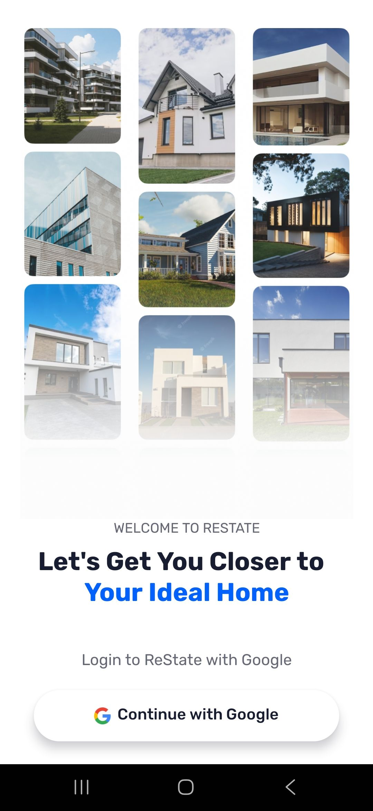
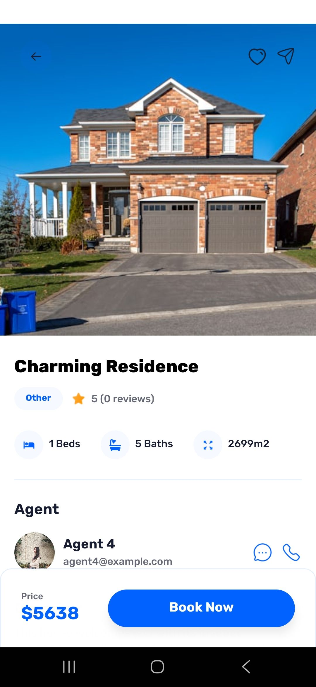
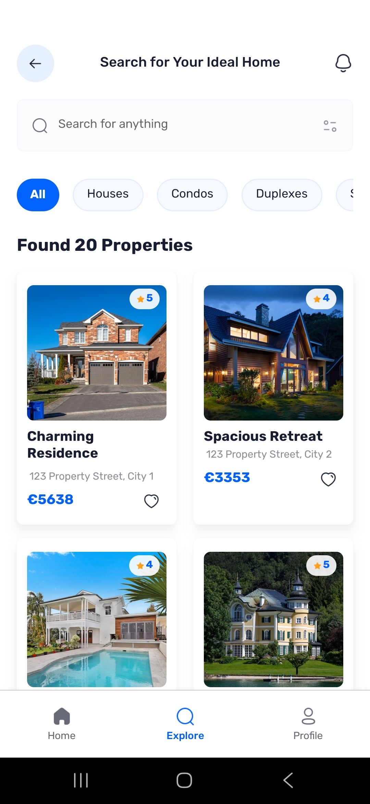
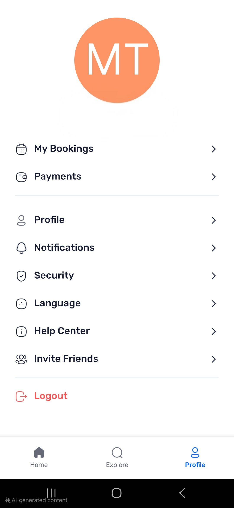

<div style="text-align: center; font-family: 'Arial', sans-serif; padding: 50px 0; background: linear-gradient(135deg, #11998e, #38ef7d); color: #fff;">
  <h1 style="font-size: 3rem; font-weight: bold; letter-spacing: 2px;">Welcome to Restate!</h1>
  <p style="font-size: 1.25rem; margin: 20px 0; font-style: italic;">A modern React Native app for buying and renting homes — built to deliver a smooth and beautiful mobile experience.</p>
  <hr style="width: 50%; border: 1px solid #ddd; margin: 40px auto; opacity: 0.5;">
</div>

```bash
npm start
# or
expo start
# or
yarn start
```

<div style="max-width: 800px; margin: 0 auto; text-align: center; font-family: 'Arial', sans-serif; padding: 40px 20px; color: #fff;">
  <h2 style="font-size: 2rem; font-weight: bold; margin-bottom: 20px;">Tech Stack</h2>
  <p style="font-size: 1.1rem; margin-bottom: 30px; font-style: italic;">
    Powered by modern cross-platform technologies to create fast, smooth, and scalable mobile experiences.
  </p>
  <ul style="list-style: none; padding: 0; display: grid; grid-template-columns: repeat(auto-fit, minmax(180px, 1fr)); gap: 10px; text-align: left;">
    <li>⚛️ React Native 0.76</li>
    <li>🚀 Expo v52</li>
    <li>🧭 Expo Router</li>
    <li>🧩 React Navigation</li>
    <li>🎨 Tailwind CSS (NativeWind)</li>
    <li>🔐 Appwrite</li>
    <li>🧪 Jest</li>
    <li>🔧 TypeScript</li>
  </ul>
</div>

## 🏡 App Screenshots

<table>
  <tr>
    <td align="center">
      <b style="display: block; margin-bottom: 8px;">Log In Restate</b> <br />
      <br />
      <br />
    </td>
    <td align="center">
      <b>House Restate</b> <br />
      <br />
      <br />
    </td>
    <td align="center">
      <b>Search Restate</b> <br />
      <br />
      <br />
    </td>
    <td align="center">
      <b>Profile Restate</b> <br />
      <br />
      <br />
    </td>
  </tr>
</table>
